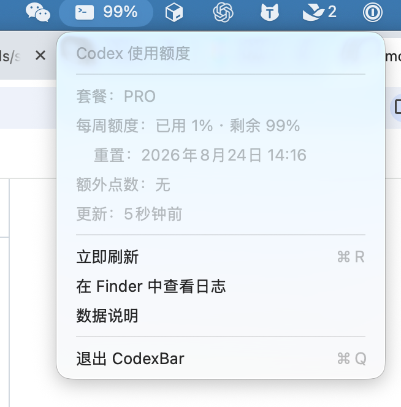

# CodexBar

CodexBar 是一个原生 macOS 菜单栏应用，实时显示 Codex 剩余额度。它每 5 秒只读扫描本机 Codex 任务日志中的 `rate_limits` 字段，不解析、显示或存储对话正文，不读取登录凭据，也不访问网络。

## 效果预览



## 功能

- 菜单栏直接显示主要额度窗口的剩余百分比
- 展示套餐、已用/剩余比例、统计窗口及重置时间
- 支持 Codex 返回的主要/次要额度和额外点数
- 自动识别 `~/.codex/sessions`，也支持 `CODEX_HOME`
- 无 Dock 图标，原生 AppKit，macOS 13 及以上

## 构建与运行

只需要 Apple Command Line Tools，不要求安装完整 Xcode：

```bash
./scripts/run.sh
```

`scripts/swift.sh` 会自动选择本机可用的 macOS SDK，兼容 Command Line Tools 中编译器与最新 SDK 小版本暂时不同步的情况。

打包成 `.app`：

```bash
./scripts/package-app.sh
open ./dist/CodexBar.app
```

安装到 `~/Applications`：

```bash
./scripts/install.sh
```

安装并设置登录时自动启动：

```bash
./scripts/install.sh --login
```

卸载（应用与启动项会移动到废纸篓）：

```bash
./scripts/uninstall.sh
```

## 第一次没有数据显示？

Codex 只有在完成请求并收到服务端额度状态后才会把 `rate_limits` 写入任务日志。先在 Codex Desktop 或 Codex CLI 中运行一次普通任务，再点击菜单中的“立即刷新”。

## 数据边界

OpenAI 目前没有公开 ChatGPT 订阅下 Codex 剩余额度的查询 API。CodexBar 使用 Codex 自己落盘的本地额度快照，因此显示值会在 Codex 完成请求后更新，而不是主动向 OpenAI 轮询账户。
